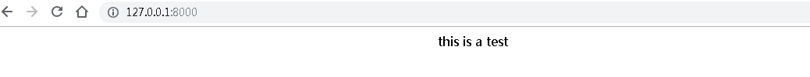
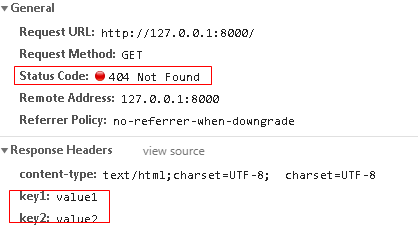
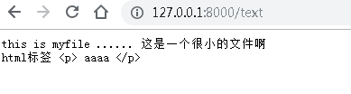
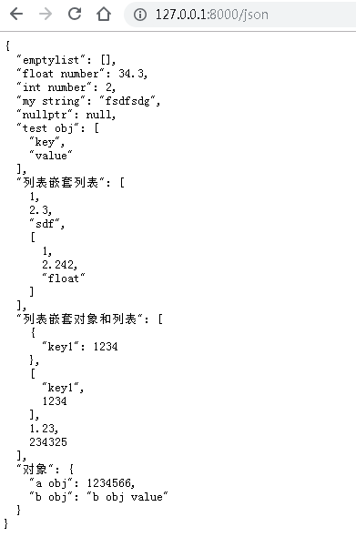
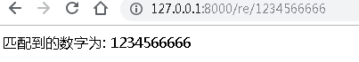
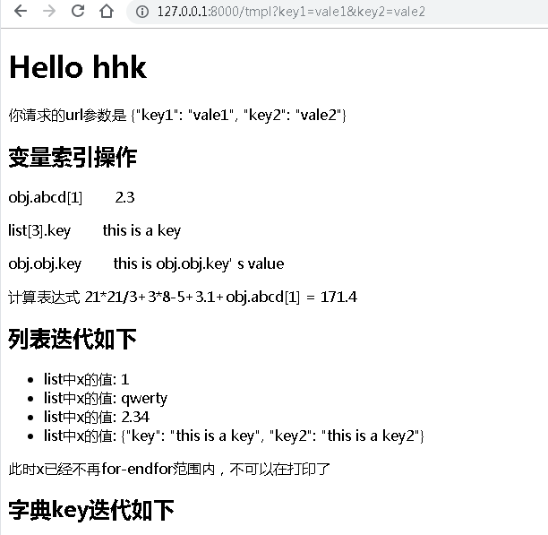

### 编译

这里bin目录下为我在windows/linux下编译好的简单服务器，可以直接运行使用，运行后在127.0.0.1:8000可以直接访问。

编译流程

```shell
cd build
cmake ..
make
./MyWebServer.exe  （或者是./MyWebServer）
```


#### 使用流程

```cpp
#include "tinyserver.h"
#include "ejson.h"

using namespace WebServer;
using namespace EasyJson;

void render_string(HttpRequest &request, HttpResponse &response) {
	// 显示html字符串，可以任意设置response_code
    response.set_header_attribute("key1", "value1") // 自定义header
            .set_header_attribute("key2", "value2")
            .set_response_code(404) // 自定义reponse code
            .set_data(R"(<center>this is a test</center>)");
}

int main() {
    IHttpServer *server = new BaseHttpServer(8000); // 如果没有参数的话默认端口8888
    server->enrol("/", render_string);
    server->run();
}
```

- 包含头文件和名称空间。
- 编写响应函数（该函数作为框架的回调函数）
- 初始化HttpServer对象
- 将响应函数注册到server中
- 进行server事件循环

浏览器访问可以看到如下。



按F12重新刷新可以看到响应Http报文的头部如下




### example

####example1:  文件下载

```cpp
void download_file(HttpRequest &request, HttpResponse &response) {
	// 文件下载
    response.set_file("myfile")
            .set_content_type(STREAM);  
}

int main() {
    IHttpServer *server = new BaseHttpServer(8000);
    server->enrol("/download", download_file);
    server->run();
}    
```

对response对象调用set_file方法和set_content_type方法，浏览器访问url后会下载对应的文件。

访问127.0.0.1/download 会自动下载文件然后保存到本地中。如果文件不存在则返回404


#### example2: 纯文本显示在浏览器上

有一些文本我们想让浏览器显示，而不被当前是html文件(即使你文件中含有html标签也不会被浏览器渲染出来)

```cpp
void render_plain_text(HttpRequest &request, HttpResponse &response) {
	// 将纯文本展示在浏览器上
    FILE *f = fopen("myfile", "rb"); 
    char buf[2048];
    size_t r = fread(buf, sizeof(char), 2048, f);
    response.set_data(buf, r)
            .set_content_type(PLAIN);
}

int main() {
    IHttpServer *server = new BaseHttpServer(8000);
    server->enrol("/text", render_plain_text);
    server->run();
}
```

编译后访问页面可以得到如下




#### example3:  返回json

这里需要依赖我编写的json库[ejson](https://github.com/HuangHongkai/ejson)  。 可以用来做rest服务

```cpp
void render_json(HttpRequest &request, HttpResponse &response) {
    // 返回json，可以做rest服务
    JSONObject obj = {
            {"test obj", {"key", "value"}},
            {"int number", 2},
            {"float number", 34.3},
            {"my string", "fsdfsdg"},
            {"nullptr", nullptr},
            {"emptylist", {}},
            {"列表嵌套列表", {1,2.3, "sdf", {1,2.242, "float"}}}, // 列表嵌套
            {"列表嵌套对象和列表", {
                {{"key1", 1234}}, // 被认为是对象
                {"key1", 1234}, // 被认为是列表
                1.23,
                234325
            }},
            {"对象", { // 所有的值都是{key, value}对则认为是嵌套对象
                {"a obj", 1234566},
                {"b obj", "b obj value"},
            }}
    };
    response.set_data(obj.toString(2)) // 将json格式化
            .set_content_type(JSON);
}

int main() {
    IHttpServer *server = new BaseHttpServer(8000);
    server->enrol("/json", render_json);
    server->run();
}
```

访问127.0.0.1:8000/json 可以得到一下页面，这里我将json以2空格缩进打印在浏览器页面上。




#### example4: url正则表达式匹配

```cpp
void re_url_test(HttpRequest &request, HttpResponse &response) {
	// 捕抓url正则表达式匹配到的内容。
    auto match = request.get_url_parm(); // 返回一个smatch对象，可以用[]操作符索引匹配结果
    stringstream ss;
    ss << R"(<html><head><meta charset="charset=UTF-8"\></head>)";
    ss << R"(<p>匹配到的数字为: )" << match[0]; 
    ss << R"(</p>)";
    ss << "</html>";
    response.set_data(ss.str());
}

int main() {
    IHttpServer *server = new BaseHttpServer(8000);
    server->enrol("/re/(\\d+)", re_url_test);
    server->run();
}
```

访问浏览器得到的结果如下




#### example5: 静态html文件

````cpp
void render_html(HttpRequest &request, HttpResponse &response) {
    // 根据不同的请求方法返回不同的内容。
    response.set_file("my.html");
}

int main() {
    IHttpServer *server = new BaseHttpServer(8000);
    server->enrol("/hmpl", render_hmpl);
    server->run();
}
````

只需要调用set_file函数就可以将你的html显示在浏览器上。(可以依此使用正则表达式匹配对应的文件，来做静态文件服务器)


#### example6: html模版文件渲染

web开发中经常会用到模版，这是为了响应动态的数据。这里我使用到自己编写的一个轻量html模板渲染库[cjinja](https://github.com/HuangHongkai/cjinja)

```cpp
void render_tmpl(HttpRequest &request, HttpResponse &response) {
	// 将html模版显示在屏幕上。
    JSONObject context = OBJECT(
            KEYVALUE("username", "hhk"),
            KEYVALUE("obj", OBJECT(
                    KEYVALUE("abcd", LIST(1,2.3, "hahahaha")),
                    KEYVALUE("obj", OBJECT(
                            KEYVALUE("key", "this is obj.obj.key' s value")
                    ))
            )),
            KEYVALUE("null", nullptr),
            KEYVALUE("list", LIST(1, "qwerty", 2.34, OBJECT(
                            KEYVALUE("key", "this is a key"),
                            KEYVALUE("key2", "this is a key2"),
                    ))),
            KEYVALUE("list1", LIST(1,2,3,4,5)),
            KEYVALUE("list2", LIST(1,2,3)),
            KEYVALUE("obj2", OBJECT(
                    KEYVALUE("key1", "value1"),
                    KEYVALUE("key2", 222),
                    KEYVALUE("key3", 333),
            )),
            KEYVALUE("a", "111"),
            KEYVALUE("b", "222"),
            KEYVALUE("c", "333"),
    );
    context.add("parm", request.get_request_parm());
    render(response, "tmpl.html", context);
}

int main() {
    IHttpServer *server = new BaseHttpServer(8000);
    server->enrol("/tmpl", render_tmpl);
    server->run();
}
```

传入了一个JSONObject作为模版渲染的数据，在浏览器端显示如下，模版文件为**tmpl.html**（位于bin目录下）

浏览器渲染的部分结果如下图所示。




#### example6: 根据请求的方法做不同的处理 

这里使用request.get_method 获取请求的请求的方法，然后根据不同的请求做不同的处理。

```cpp
void render_html(HttpRequest &request, HttpResponse &response) {
    // 根据不同的请求方法返回不同的内容。
    if(request.get_method() == GET ) {
        response.set_file("my.html");
    } else if(request.get_method() == POST) {
        response.set_file("my2.html");
    }
}

int main() {
    IHttpServer *server = new BaseHttpServer();
    server->enrol("/html", render_html);
    server->run();
}
```